# Paedia feature prioritisation — RICE assessment

**Version:** 1.0 · **Date:** 2026-06-15  
**Scope:** RICE scoring for proposed product features to guide sequential planning.  
**Baseline assumption:** ~500 monthly active users (MAU) unless analytics show otherwise.

---

## How to use this document

1. Pick the next feature from the ranked list (or override with product policy).
2. Open a dedicated implementation plan for that feature only.
3. After shipping, update the **Status** column and recalculate RICE if reach/effort changed.

**RICE formula:** `(Reach × Impact × Confidence) ÷ Effort`

| Dimension | Definition |
|-----------|------------|
| **Reach** | Users affected per quarter (estimated from 500 MAU baseline) |
| **Impact** | Per-user value: 3 = massive, 2 = high, 1 = medium, 0.5 = low, 0.25 = minimal |
| **Confidence** | 0.25–1.0 — certainty about reach, impact, and effort estimates |
| **Effort** | Person-months at ~15 hrs/week solo dev (1 week ≈ 0.25 PM) |

---

## Product context

Paedia is a **90-day Christian discipleship programme** delivered as a Flutter app (web, iOS, Android) with Firebase backend and Retool CMS.

| Area | Current state |
|------|----------------|
| Daily loop | Today tab — reflections, copy, PDF export |
| Groups | Community tab — roster, two editable key dates; no Zoom link, no ICS |
| Manuals | Participant + accessory; fuzzy search **per manual** (not unified) |
| Solo users | Allowed — group membership optional |
| Content | Retool → Firestore; app read-only on `days` / manuals |
| Admin | Group create blocked in client rules; Rowy/Admin SDK for ops |

**Already shipped (Phase A):**

- Universal copy/paste — per-section + copy-all on reflections and manuals
- PDF tomorrow + Kindle/e-reader help dialog

See [REVAMP_STRATEGY.md](./REVAMP_STRATEGY.md) for architecture and migration context.

---

## RICE scorecard (ranked)

| Rank | Feature | R | I | C | E (PM) | **RICE** | Status |
|------|---------|---|---|---|--------|----------|--------|
| 1 | Zoom / conference one-click join | 300 | 2.0 | 0.90 | 0.15 | **3,600** | Not started |
| 2 | Application link (non-group users) | 75 | 2.0 | 0.90 | 0.10 | **1,350** | Minimal empty state |
| 3 | Cross-manual unified search | 180 | 1.5 | 0.90 | 0.20 | **1,215** | Per-manual search only |
| 4 | Group key dates — calendar + list + ICS | 280 | 2.0 | 0.85 | 0.50 | **952** | ~40% done |
| 5 | Undo snackbar (field changes) | 200 | 1.0 | 0.85 | 0.35 | **486** | Not started |
| 6 | Mobile app download nudge | 120 | 1.0 | 0.80 | 0.20 | **480** | Not started |
| 7 | Day image ranges | 500 | 0.5 | 0.70 | 0.40 | **437** | Blocked on CMS |
| 8 | Reflection search + bookmarks + questions | 250 | 1.5 | 0.75 | 0.75 | **375** | Not started |
| 9 | Require group membership | 500 | 1.0 | 0.50 | 0.75 | **333** | Not started |
| 10 | Redesign daily interactions | 450 | 2.0 | 0.50 | 2.00 | **225** | ~55% done |
| 11 | Better onboarding (Lectio 365–style) | 125 | 2.0 | 0.65 | 1.00 | **163** | Functional baseline |
| 12 | YouVersion Bible API / reader | 400 | 1.5 | 0.40 | 2.00 | **120** | Not started |
| 13 | Redesign manuals | 200 | 1.0 | 0.55 | 1.00 | **110** | ~65% done |
| 14 | CMS image upload backend | 500 | 1.0 | 0.55 | 3.00 | **92** | Not started |
| 15 | Admin group creation + roles | 150 | 2.0 | 0.60 | 2.00 | **90** | Admin-only today |
| 16 | Platform-native styling | 500 | 0.5 | 0.45 | 3.00 | **38** | Unified theme today |
| — | Universal copy/paste | 450 | 2.0 | 0.95 | 0.50 | **1,710** | **Shipped** |
| — | PDF tomorrow + Kindle help | 80 | 1.5 | 0.90 | 0.15 | **720** | **Shipped** |

---

## Feature deep dives

### Zoom / conference one-click join — RICE 3,600

**Problem:** Weekly group meetups are central; no meeting URL on group documents today.

**Codebase:** [`lib/features/community/community_screen.dart`](../lib/features/community/community_screen.dart), [`lib/data/models/group.dart`](../lib/data/models/group.dart). No `meetingUrl` field.

**Schema gap:**

```json
groups/{id}: {
  "meetingUrl": "https://zoom.us/j/...",
  "meetingLabel": "Weekly meetup"
}
```

**Pros:** Small diff; `url_launcher` in stack; provider icon detection (Zoom/Meet/Teams).  
**Cons:** Edit permissions (any member vs leader); link rot.  
**Effort:** ~3 days · **Dependencies:** Retool/Rowy field, optional rules refinement.

---

### Application link for non-group users — RICE 1,350

**Problem:** Community empty state is a dead end — no application form or mailto link.

**Codebase:** [`community_screen.dart`](../lib/features/community/community_screen.dart) lines 54–61.

**Pros:** Quick win — `app_config` Firestore doc or env URL + CTA buttons.  
**Cons:** Open sign-up policy; manual staff process unless Resend/Functions added later.  
**Effort:** 1–2 days.

---

### Cross-manual unified search — RICE 1,215

**Problem:** Search exists per manual; hub has no single search bar across both.

**Codebase:** [`lib/shared/utils/manual_search.dart`](../lib/shared/utils/manual_search.dart), [`lib/shared/widgets/manual_sections_list.dart`](../lib/shared/widgets/manual_sections_list.dart), [`lib/features/manuals/manual_hub_screen.dart`](../lib/features/manuals/manual_hub_screen.dart).

**Pros:** Reuse fuzzy search; no schema/rules changes.  
**Cons:** Tag results with manual source; two Firestore streams.  
**Effort:** 3–5 days.

---

### Group key dates — calendar, list, ICS — RICE 952

**Problem:** Two fixed key dates editable as a list; no calendar view or add-to-calendar export.

**Codebase:** [`GroupKeyDate`](../lib/data/models/group.dart), [`groups_repository.dart`](../lib/data/repositories/groups_repository.dart), [`community_screen.dart`](../lib/features/community/community_screen.dart).

**Pros:** Model and save path exist (~40% done); ICS can be client-generated.  
**Cons:** Sparse with only two labels; timezone handling; **proposed rules in `firestore.rules.proposed` would break member edits** if deployed without field-scoped rules.  
**Effort:** 1–2 weeks.

---

### Undo snackbar — RICE 486

**Problem:** Profile and group edits save without revert; accidental changes are permanent.

**Codebase:** Debounced save in [`profile_screen.dart`](../lib/features/profile/profile_screen.dart); immediate save in [`groups_repository.dart`](../lib/data/repositories/groups_repository.dart).

**Pros:** Material `SnackBar` with action; snapshot pre-write client-side.  
**Cons:** Scope “all fields” is broad; concurrent edits; debounce interaction on profile.  
**Effort:** Start with group key dates + profile (~1 week).

---

### Mobile app download nudge — RICE 480

**Problem:** Web users on mobile devices are not guided to the native app.

**Codebase:** [`profile_screen.dart`](../lib/features/profile/profile_screen.dart); web deployed via Vercel.

**Pros:** Isolated profile card; `kIsWeb` + user-agent detection.  
**Cons:** Must not nudge installed users; needs store URLs.  
**Effort:** 1–3 days (web banner) to 1 week (deep links + dismiss persistence).

---

### Day image ranges — RICE 437

**Problem:** One illustration URL per day; content team wants thematic ranges (e.g. days 1–10).

**Codebase:** `days.Illustration` in [`days_record.dart`](../lib/backend/schema/days_record.dart); [`day_illustration.dart`](../lib/shared/widgets/day_illustration.dart) behind experimental flag.

**Pros:** Fewer assets; better art direction.  
**Cons:** **Depends on CMS upload backend** or Retool schema change.  
**Effort:** ~1 week after CMS.

---

### Reflection search + bookmarks + questions callout — RICE 375

**Problem:** No search across 90 days; no bookmarks; questions buried in accordion sections.

**Codebase:** [`reflections_screen.dart`](../lib/features/reflections/reflections_screen.dart); reuse patterns from [`manual_search.dart`](../lib/shared/utils/manual_search.dart).

**Pros:** Questions callout is a small visual win; bookmarks drive re-engagement.  
**Cons:** 90-day corpus is small for search; bookmarks need Firestore schema + rules.  
**Effort:** Questions **S** · Bookmarks **M** · Search **M**.

**Schema gap:**

```json
users/{uid}/bookmarks/{dayNumber}  // or bookmarkedDays: number[]
```

---

### Require group membership — RICE 333

**Problem:** Solo users can run the full programme; product model is small-group discipleship.

**Codebase:** Router in [`nav.dart`](../lib/flutter_flow/nav/nav.dart) gates gender + start date only.

**Pros:** Aligns product with group model.  
**Cons:** Breaking change; needs assignment flow first; may require rules changes on `days`.  
**Effort:** 1–2 weeks app-only; longer with content gating.  
**Dependencies:** Application link (#2) and/or admin group creation (#15).

---

### Redesign daily interactions — RICE 225

**Problem:** Today tab is functional but not competitive with reference apps (e.g. Lectio 365).

**Codebase:** Rewritten [`reflections_screen.dart`](../lib/features/reflections/reflections_screen.dart) (~55% of vision).

**Pros:** Core product surface; highest differentiation potential.  
**Cons:** Subjective design; large regression risk; overlaps reflection search/bookmarks.  
**Effort:** 2–4+ weeks · **Confidence low** without mocks.

---

### Better onboarding — RICE 163

**Problem:** 3-step stepper works but lacks polish and programme narrative.

**Codebase:** [`onboarding_screen.dart`](../lib/features/auth/onboarding_screen.dart), [`login_screen.dart`](../lib/features/auth/login_screen.dart).

**Pros:** Improves week-1 retention for new cohorts (~25% MAU/quarter).  
**Cons:** Design-heavy; order relative to group gating matters.  
**Effort:** ~2–4 weeks with design.

---

### YouVersion Bible API — RICE 120

**Problem:** Scripture is static CMS HTML; no linked Bible reader.

**Pros:** Richer reading experience.  
**Cons:** **API licensing/partnership unknown**; duplicates curated content; large new UI.  
**Effort:** 2+ weeks · **Confidence 0.40**.

---

### Redesign manuals — RICE 110

**Problem:** Manuals work (search, accordions, copy) but long reads need navigation polish.

**Codebase:** [`manual_hub_screen.dart`](../lib/features/manuals/manual_hub_screen.dart), [`manual_sections_list.dart`](../lib/shared/widgets/manual_sections_list.dart) (~65% done).

**Effort:** ~2 weeks · Lower ROI vs cross-manual search.

---

### CMS image upload backend — RICE 92

**Problem:** Retool is sole CMS; no in-repo upload pipeline for day illustrations.

**Codebase:** Profile upload in [`user_repository.dart`](../lib/data/repositories/user_repository.dart); [`firebase/STORAGE_CORS.md`](../firebase/STORAGE_CORS.md).

**Pros:** Strategic Retool migration start.  
**Cons:** Multi-month — Functions, admin auth, Storage rules, workflow change.  
**Effort:** 2–3+ person-months.

---

### Admin group creation + roles — RICE 90

**Problem:** Groups created only via Console/Rowy/Admin SDK; no in-app roles.

**Codebase:** [`firestore.rules`](../firebase/firestore.rules) `groups` create: false; [`seed-test-group-admin.mjs`](../scripts/seed-test-group-admin.mjs).

**Effort:** 2+ person-months · **Blocks scalable group gating.**

---

### Platform-native styling — RICE 38

**Problem:** Unified theme hardcodes iOS scroll physics for all platforms ([`paedia_theme.dart`](../lib/shared/theme/paedia_theme.dart)).

**Pros:** Premium native feel (Liquid Glass, Material You).  
**Cons:** 3× maintenance; brand fragmentation.  
**Effort:** 2–3+ person-months · Keep behind experimental flags.

---

## Recommended planning waves

```mermaid
flowchart LR
  subgraph wave1 [Wave 1 - Quick wins]
    Z[Zoom join]
    A[Application link]
    S[Cross-manual search]
  end
  subgraph wave2 [Wave 2 - Community]
    K[Key dates + ICS]
    U[Undo snackbar]
    M[Mobile app nudge]
  end
  subgraph wave3 [Wave 3 - Engagement]
    Q[Questions callout]
    B[Bookmarks + reflection search]
    O[Onboarding polish]
  end
  subgraph wave4 [Wave 4 - Strategic]
    G[Group gating]
    AD[Admin groups + roles]
    CMS[CMS image backend]
    D[Daily redesign]
  end
  wave1 --> wave2 --> wave3 --> wave4
```



| Wave | Features | Rationale |
|------|----------|-----------|
| **1** | Zoom join → Application link → Cross-manual search | Highest RICE, lowest effort, no rules risk |
| **2** | Key dates + ICS → Undo → Mobile nudge | Community value + safety nets |
| **3** | Questions callout → Bookmarks/search → Onboarding | Engagement without full redesign |
| **4** | Group gating + admin → CMS → Daily/manual redesign → Bible API → Platform styling | Policy, backend, design bets |

---

## Caveats

1. **Reach uses 500 MAU baseline** — recalculate if Firebase Analytics shows different scale.
2. **RICE favours quick wins** — CMS migration scores low despite long-term strategic value.
3. **Group gating and admin tooling are coupled** — plan together even when scored separately.
4. **Firestore rules** — see [FIRESTORE_RULES_REVIEW.md](./FIRESTORE_RULES_REVIEW.md) before features that write new group/user fields.
5. Update this doc when a feature ships or when effort estimates change after planning.

---

## Related docs

- [REVAMP_STRATEGY.md](./REVAMP_STRATEGY.md) — architecture and phased migration
- [SCHEMA_MIGRATION.md](./SCHEMA_MIGRATION.md) — Retool/Firestore field changes
- [TEST_ACCOUNTS.md](./TEST_ACCOUNTS.md) — dev accounts for QA (solo vs group)
